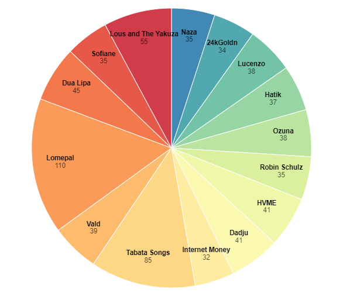
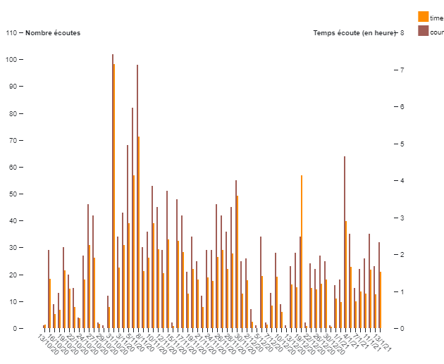
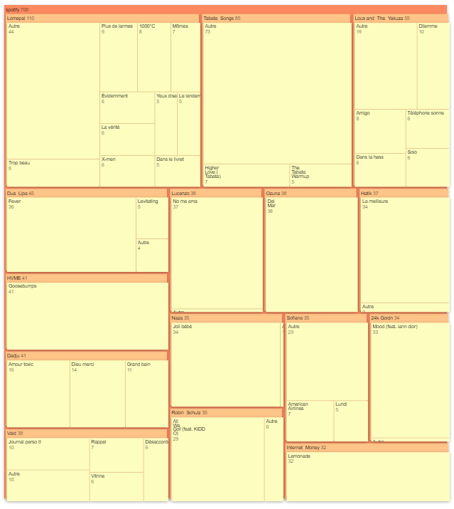
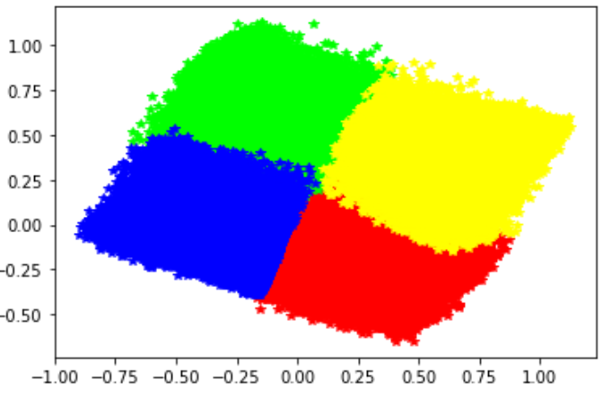
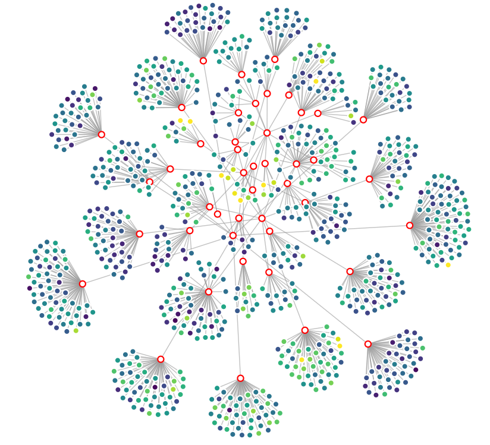
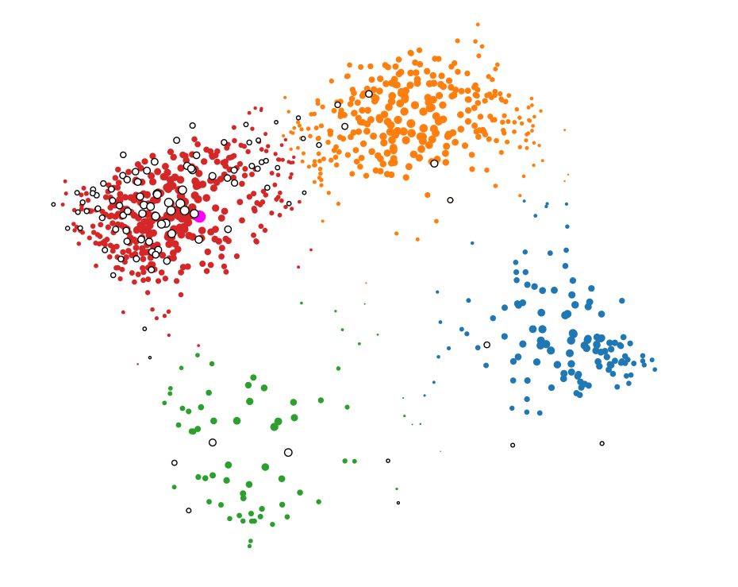

# SpotifyDataVisualizationProject

This project has been developped by **Théo Malka-Lacombe**, **Maxime Peter** and **Julien Verdun** within the scope of a data visualization class at Ecole Centrale Lyon.

This repository includes the file required to process Spotify data from different sources (user data or public dataset).

The data are then explored and drew on different **Observable notebook**. The following [notebook](https://observablehq.com/@julien-verdun/spotify-data-visualization-project) summarize and gather the links to the different notebook.

## Get your data

Get your data from your Spotify account [My Personnal Data](https://support.spotify.com/uk/article/data-rights-and-privacy-settings/).

You can get a ZIP file with a copy of most of your personal data by using the automated Download your data function on the Privacy Settings section of your account page.

The download includes information about your playlists, streaming history, searches, a list of items saved in Your Library, the number of followers you have, the number of accounts you follow, the names of the artists you follow, and your payment and subscription data.

### Data processing with Python

The data are stored on the `MyData` folder. There are one folder per user and several files `StreamingHistoryN.json` per user's folder.

### Create a Spotify Developer account

You need a Spotify Developer Account in order to make some requests to the Spotify API. You can create one with the following link [Spotify Developer Account](https://developer.spotify.com/).

### Features extraction

Create a json file `my_spotify_dev_account.json` on this folder with the keys and values :

```
{
    "username": "your_user_name",
    "client_id": "your_client_id",
    "client_secret": "your_client_secret",
    "redirect_uri": "http://localhost:7777/callback",
    "scope": "user-read-recently-played"
}
```

Then choose the folder you want to extract features from on the file `extract_songs_features.py`, for example
with `folder = "Julien"` you will get the features by all the songs listened by me.

Make sur you got all the required python librarires installed (especially **spotipy**) and then run `python extract_song_features.py`.

It can make some time and you need an internet connection to connect the Spotify API. The songs will be extracted from the StreamingHistory files and then their features will be requested to the Spotify API.

The file `{folder}/track_data.json` will then be created.
This file includes for every songs listened a list of features (float values) such as **danceability**, **energy**, **loudness**, **speechiness**, **acousticness**, **instrumentalness**, **liveness**, **valence**, **tempo**, **duration_ms**, **popularity** but also the artists and the album's name.

### Data normalization

The jupyteer notebook `my_spotify_data_enrichment.ipynb` allows you to normalize the data. It creates a json file `{folder}/track_data_normalized.json`. Make sure you set the right folder's name.

## Spotify data exploration

The visualization below are some D3.js visualization around user data.

A **pie chart** with user nummber of listening per artists.



A stacked chart with user number of listening and listening time over the days.



A chart with the user listening repartition per artists and then per musics.



A chart with the features distribution (energy, accousticness, danceability, etc) for a given song.


A chart with the distribution of the user listened song over all music features.


## Recommendation

This part describes the use of Spotify data to make **music recommendations** for Spotify users depending on their streaming history.

### Data description

The folder `Recommendation` includes the data from the Kaggle dataset [Spotify dataset](https://www.kaggle.com/yamaerenay/spotify-dataset-19212020-160k-tracks) : `data.csv`. This dataset includes over 160.000 songs features.

The personnal data extracted and processed in the first part are also used.

### Data Processing

The jupyter notebook `kaggle_data_enrichment.ipynb` includes the python code to process data and creates the necessary json files.

The **Kaggle data** includes some numerical features (danceability, energy, etc) and some non-numerical features (album, artist, etc).

First, the **data are normalized** using sklearn MinMaxScaler algorithm.

Then, musics from Kaggle dataset are **clustered** using sklearn **KMeans** algorithm.

The dimension of the data (11 numerical dimensions) is reduced by performing a **PCA** with sklearn. The PCA allows to reduce the dimension to 2 dimensions with **60% of explained data variability**. It allows us to project the songs on a 2D space and to visualize the distance between them.

The Figure below shows the songs from the Kaggle dataset, clustered (4 clusters) and projected on the 2 main dimensions given by the PCA.



The cluster and the new coordinates of each song are stored with songs' features in the json file `songs_json.json`.

The data from users, that we got from the Spotify Web API, explained in the first part of this document (Get your Data) are stored in the file `user_track_data_normalized.json`.
They are processed the same way : clusterisation and dimension reduction and stored with songs' features in the file `user_songs_json.json`.

Both json file `songs_json.json` and `user_songs_json.json` are used to create a recommendation visualization.

### Visualization

The idea of the visualization is to allow to the user to represent the music he listened to among other songs. Then the user can look for a particular song or simply wander the visualization, and find the songs similar to the song he listened to.

#### Graph representation

A first chart was created with this [Observable notebook](https://observablehq.com/@julien-verdun/spotify-music-suggestions?collection=@julien-verdun/spotifydatavisualizationproject). It representes the clusters and sub-clusters for a few songs of the Kaggle dataset.

We can read on this graph the songs that are similar in terms of features' distance.



#### Scatter plot representation

The Figure below is a representation of a part of the user data (white circles) among a part of the Kaggle clustered data.

This [Observable notebook](https://observablehq.com/@julien-verdun/spotify-musics-wandering) drew this visualization.

It seems that this user listened to a lot of music from the red cluster. Thus he can see what are the other music in this part he didn't already listen to and go steam it on is favorite music application.


